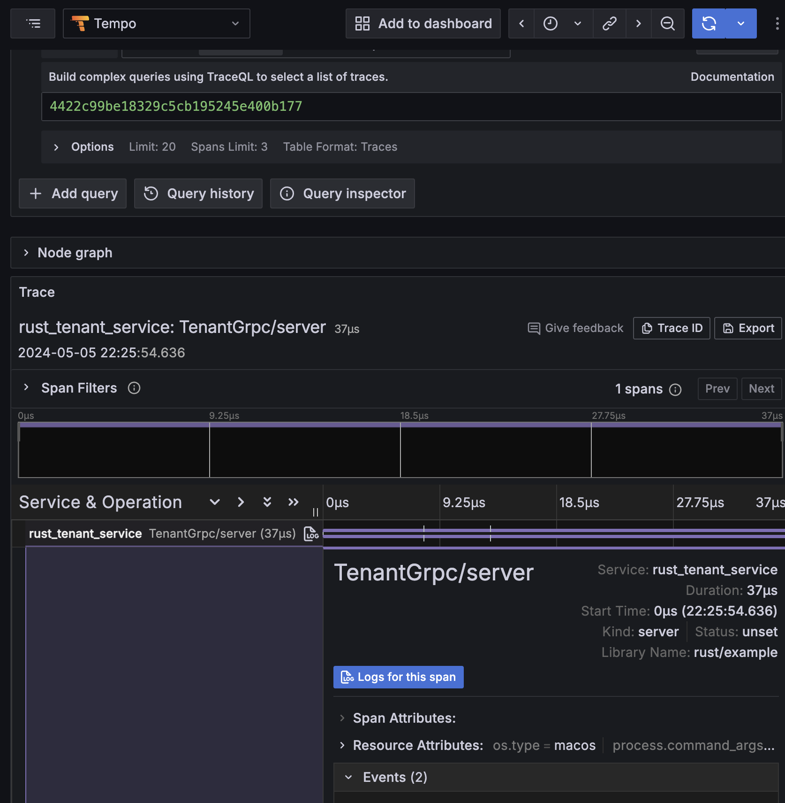

# Rust Grpc Example

This project is an example of using gRPC in Rust.
It demonstrates how to implement a gRPC server and client in Rust, and provides a simple example of a service and its corresponding client.

## Table of Contents

- [Technical stack](#technical-stack)
- [Installation](#installation)
- [Usage](#usage)
- [License](#license)

## Technical stack

- [Rust](https://www.rust-lang.org/fr)
- [GRPC](https://grpc.io/)
- [Opentelemetry](https://opentelemetry.io/)
- [Opentelemetry Rust Github](https://github.com/open-telemetry/opentelemetry-rust)

## Installation

You need to have docker installed on your host machine

## Usage

Run telemetry stack with this docker command: 

`docker run -p 3000:3000 -p 4317:4317 -p 4318:4318 --rm -ti grafana/otel-lgtm`

Run application with log level info: 

`OTEL_SERVICE_NAME=rust_tenant_service cargo run`

After application started, you can call the application GRPC service named `TenantGrpc` with postman with url: [localhost:50501](localhost:50501)
You need to specify [this proto file](proto/tenant.proto)

You can visualize telemetry with prometheuse stack at [localhost:3000](localhost:3000)

Grafana span:

Grafana logs:

## License

MIT License.
